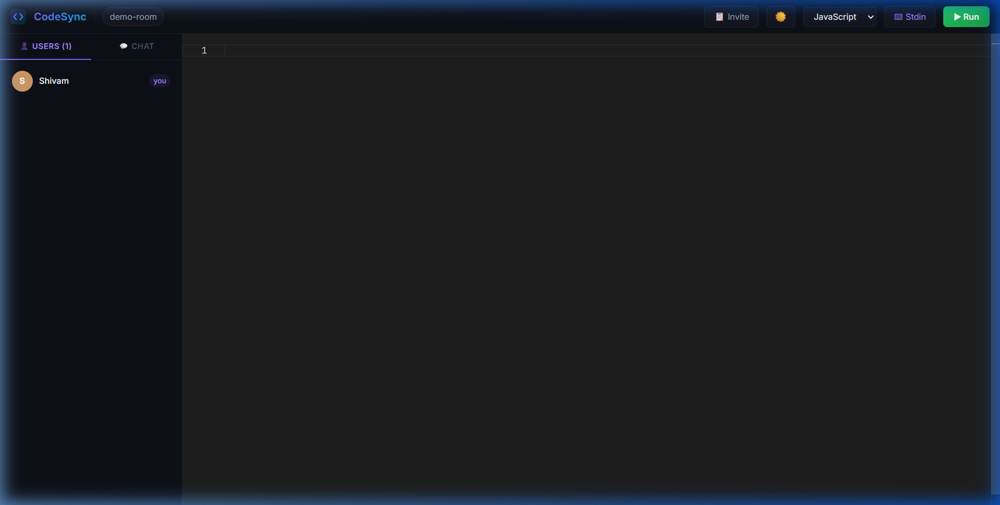
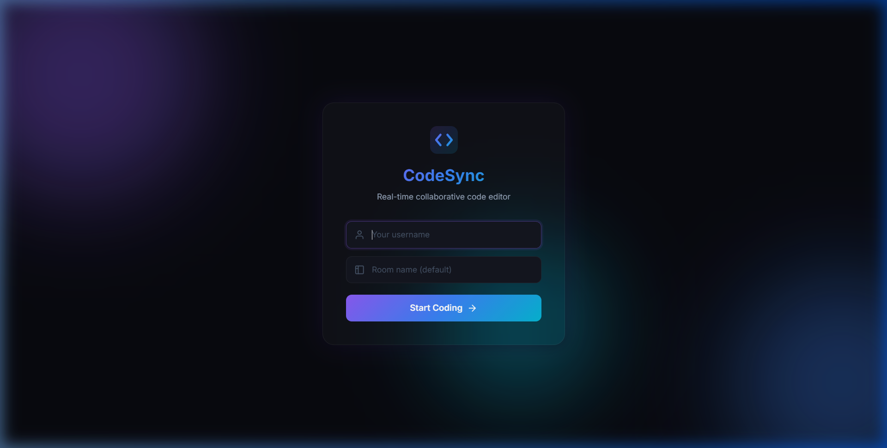

<div align="center">
  
  <br>
  <h1>💻 CodeSync</h1>
  <p><strong>A Real-time Collaborative Code Editor with Live Execution</strong></p>

  <p>
    <a href="https://code-sync-orcin.vercel.app" target="_blank"></a>
  </p>

  <p>
    <a href="#features">Features</a> •
    <a href="#tech-stack">Tech Stack</a> •
    <a href="#live-demo">Live Demo</a> •
    <a href="#getting-started">Getting Started</a> •
    <a href="#deployment">Deployment</a>
  </p>
</div>

---

**CodeSync** is a highly responsive, modern, and aesthetic web-based IDE built for pair programming and remote collaboration. It combines the power of Microsoft's **Monaco Editor** with **Yjs** CRDT algorithms to deliver a seamless zero-conflict coding experience, alongside a live remote execution engine capable of compiling and running code in real-time.

---

## 📸 Screenshots

### Editor View
Experience real-time sync with teammates in a sleek dark-themed IDE, featuring integrated chat and standard input/output execution panels.



### Join Room Lobby
Seamlessly join rooms alongside a beautiful glassmorphic experience.



---

<a id="features"></a>

## ✨ Features

- **⚡ Real-time Collaboration**: True multiplayer editing powered by Yjs and WebSockets with zero conflict or lag.
- **🏷️ Remote Cursor Presence**: See exactly where your teammates are typing with color-coded, labeled floating carets.
- **🏃‍♂️ Live Code Execution**: Write and instantly execute code in multiple languages (Python, JavaScript, C++, Java, etc.) right in the browser.
- **⌨️ Stdin Support**: Provide standard input for your programs through a dedicated input panel.
- **🖥️ Native Terminal Output**: Outputs standard streams (stdout/stderr) natively and aesthetically.
- **💬 Built-in Room Chat**: Discuss algorithms and bugs with your team without leaving the IDE view.
- **🌗 Aesthetic UI**: Beautifully designed glassmorphic joining screens, distinct Light/Dark themes, and a responsive layout that works flawlessly on desktop devices.

---

<a id="tech-stack"></a>

## 🛠️ Tech Stack

### Frontend
- **Framework**: React 19 + Vite
- **Styling**: Tailwind CSS & Vanilla CSS (custom tokens)
- **Editor Engine**: `@monaco-editor/react`
- **Real-Time Data**: `y-monaco`, `y-socket.io`, `yjs`
- **Output Display**: `xterm.js` for native terminal rendering
- **PWA**: `vite-plugin-pwa` for installable app support

### Backend
- **Server Environment**: Node.js & Express
- **Socket Network**: `socket.io` for seamless WebSockets
- **Data Sync**: `y-socket.io` to sync operations reliably across clients
- **Code Execution**: Proxying requests to the Wandbox Compilation API for isolated compilation
- **Security**: `express-rate-limit` for API rate limiting

---

<a id="live-demo"></a>

## 🌐 Live Demo

CodeSync is deployed and available at:

| Service | URL |
|---------|-----|
| **Frontend** (Vercel) | [code-sync-orcin.vercel.app](https://code-sync-orcin.vercel.app) |
| **Backend** (Render) | [codesync-backend-atrp.onrender.com](https://codesync-backend-atrp.onrender.com) |

> **Note**: The backend is hosted on Render's free tier, so the first request after inactivity may take ~30–60 seconds while the server spins up.

---

<a id="getting-started"></a>

## 🚀 Getting Started

### Local Development

1. **Clone the repository**
   ```bash
   git clone https://github.com/Shivam-agarawal/CodeSync.git
   cd CodeSync
   ```

2. **Install Frontend Dependencies**
   ```bash
   cd Frontend
   npm install
   ```

3. **Install Backend Dependencies**
   ```bash
   cd ../Backend
   npm install
   ```

4. **Start the Application**
   ```bash
   # From the Backend directory, start both client and server concurrently:
   npm run dev
   ```
   > The app will automatically open in your default browser at `http://localhost:5173`.

---

<a id="deployment"></a>

## 🚢 Deployment

CodeSync uses a split deployment architecture:

| Component | Platform | Why |
|-----------|----------|-----|
| **Frontend** | [Vercel](https://vercel.com) | Fast static hosting with global CDN |
| **Backend** | [Render](https://render.com) | Persistent Node.js process with WebSocket support |

### Environment Variables

**Backend (Render):**
| Variable | Description |
|----------|-------------|
| `PORT` | Server port (default: `4000`) |
| `NODE_ENV` | Set to `production` |
| `CORS_ORIGINS` | Your Vercel frontend URL |

**Frontend (Vercel):**
| Variable | Description |
|----------|-------------|
| `VITE_BACKEND_URL` | Your Render backend URL |

> Vite environment variables must start with `VITE_` to be accessible in client-side code.

---

## 🤝 Contributing

Contributions, issues, and feature requests are always welcome! Feel free to check the [issues](https://github.com/Shivam-agarawal/CodeSync/issues) page if you want to contribute.

## 📝 License

This project is licensed under the **ISC License**.
